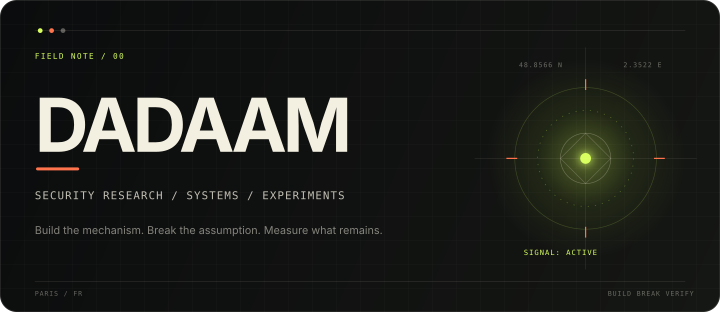
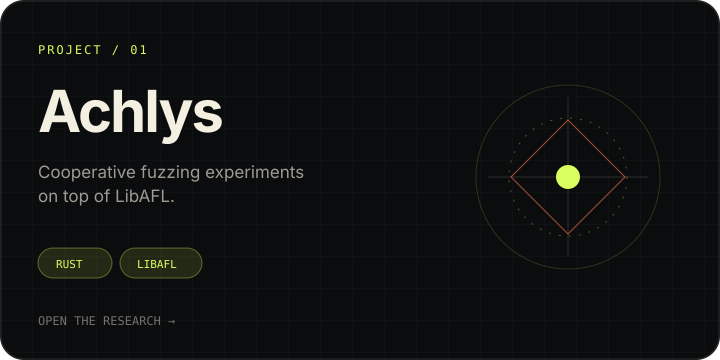
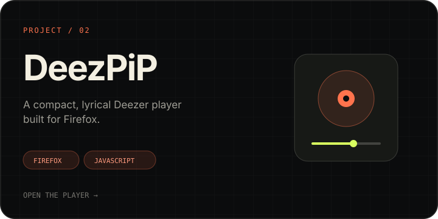
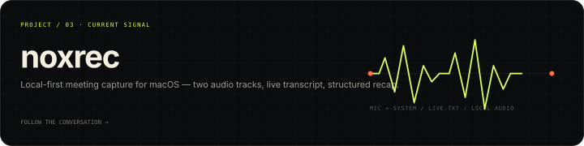

<div align="center">



<br />

<a href="https://dadaam.github.io/"></a>
<a href="https://github.com/Dadaam?tab=repositories"></a>
<a href="mailto:chtouroudadam@gmail.com"></a>

</div>

<br />

I build security research, systems tools, and small experiments designed to survive contact with reality. The interesting part is rarely the pitch. It is the mechanism, the failure mode, and the evidence left behind.

```text
method     build → break → measure → document
focus      fuzzing / application security / agentic systems
tools      Rust / Python / JavaScript / macOS / Linux
standard   explicit limits, reproducible claims
```

## Selected field work

<table>
<tr>
<td width="50%" valign="top">
<a href="https://github.com/Dadaam/Achlys"></a>
</td>
<td width="50%" valign="top">
<a href="https://github.com/Dadaam/DeezPiP"></a>
</td>
</tr>
</table>

<a href="https://github.com/Dadaam/noxrec"></a>

## What I investigate

<table>
<tr>
<td width="25%" valign="top"><b>01 / FUZZING</b><br /><sub>Coverage, mutation strategies, worker coordination, and the gap between a benchmark and a claim.</sub></td>
<td width="25%" valign="top"><b>02 / SECURITY</b><br /><sub>Application flaws, browser boundaries, adversarial AI, and controlled proof of impact.</sub></td>
<td width="25%" valign="top"><b>03 / SYSTEMS</b><br /><sub>Tools that expose their real state, fail loudly, and leave evidence another person can reproduce.</sub></td>
<td width="25%" valign="top"><b>04 / NOTES</b><br /><sub>Technical field reports about the rabbit holes worth keeping, including the limits and dead ends.</sub></td>
</tr>
</table>

## Operating principles

```text
evidence      >  confidence
small proof   >  broad promise
real path     >  configured path
limitations   =  part of the result
```

## Working set

<div align="center">


</div>

## Field notes

Long-form write-ups live at **[dadaam.github.io](https://dadaam.github.io/)** — security research, systems experiments, and honest postmortems from ideas that met the real world.

<br />

<div align="center">

<sub>PARIS, FRANCE · AVAILABLE FOR INTERESTING PROBLEMS</sub>

<br /><br />

<a href="mailto:chtouroudadam@gmail.com"><b>Start a conversation →</b></a>

</div>
