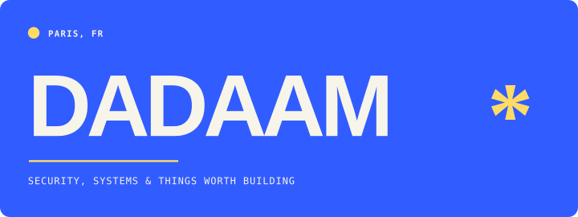

# Hi, I'm Dadaam.

I'm a security researcher and builder based in Paris.

Most of my work sits somewhere between fuzzing, application security, systems programming, and tools I wanted badly enough to build myself. I care about reproducible results, clear limits, and writing down the parts that did not work.

### What I'm working on

#### [Achlys](https://github.com/Dadaam/Achlys)

An experimental cooperative fuzzing system built in Rust on top of LibAFL. It is where I test ideas around worker coordination, coverage, and what actually survives a fair benchmark.

#### [noxrec](https://github.com/Dadaam/noxrec)

A macOS meeting recorder with separate microphone and system-audio tracks. It also produces a live transcript that an agent can follow while the meeting is still happening.

#### [DeezPiP](https://github.com/Dadaam/DeezPiP)

A compact Deezer player for Firefox with synchronized lyrics, playback controls, and theming pulled from the current album cover.

### Notes

I write about security research, systems experiments, and the occasional rabbit hole at **[dadaam.github.io](https://dadaam.github.io/)**.

### Usually working with

`Rust` · `Python` · `JavaScript` · `TypeScript` · `Bash` · `Linux` · `macOS`

---

[All repositories](https://github.com/Dadaam?tab=repositories) · [Blog](https://dadaam.github.io/) · [Email](mailto:chtouroudadam@gmail.com)
